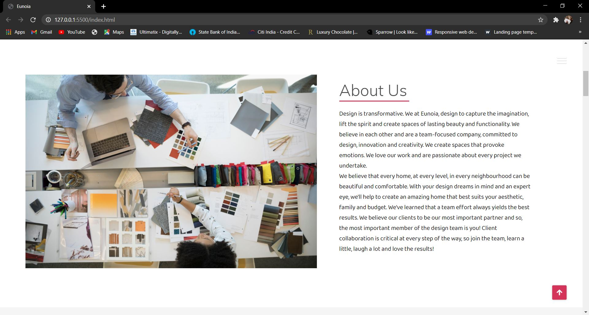
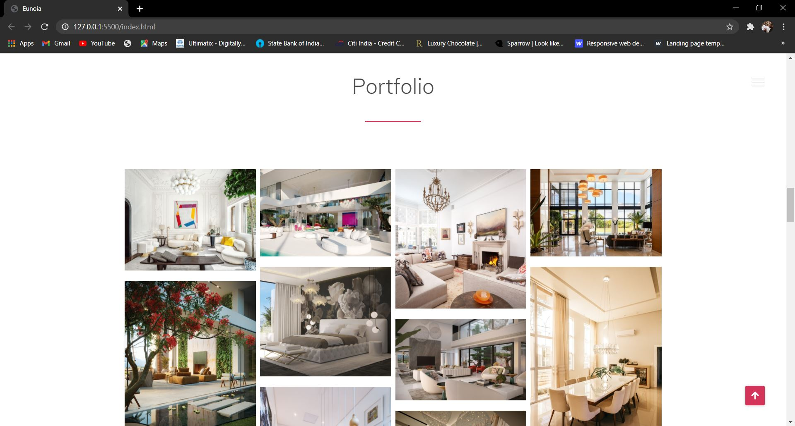

# Eunoia
<h3>
  <i>Eunoia - A Business Portfolio Website. ( Created using HTML5, CSS3, JS )</i>
  </h3>

 
 

<i>
  <h5 align= "center"> The Home Page</h5>
</i>

  

 
 

<i>
  <h5 align= "center"> The About Section</h5>
</i>

  

 
 

<i>
  <h5 align= "center"> The What We Do Section</h5>
</i>

  

 
 

<i>
  <h5 align= "center"> The Parallax Section</h5>
</i>

  

 
 

<i>
  <h5 align= "center"> The Portfolio Section</h5>
</i>

  

 
 

<i>
  <h5 align= "center"> The Interior Page </h5>
</i>

  

  

 
 

<i>
  <h5 align= "center"> The Architecture Page </h5>
</i>

  

  

 
 

<i>
  <h5 align= "center"> The Team Section</h5>
</i>

  

 
 

<i>
  <h5 align= "center"> The Hire Section</h5>
</i>

  

  

 
 

<i>
  <h5 align= "center"> The Contact Section</h5>
</i>

  

  

